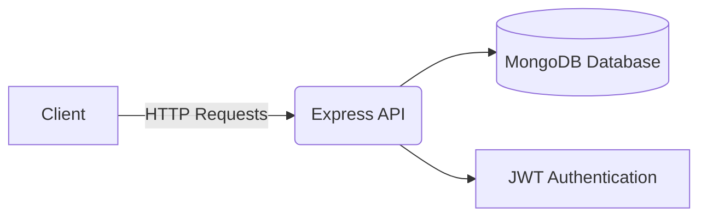
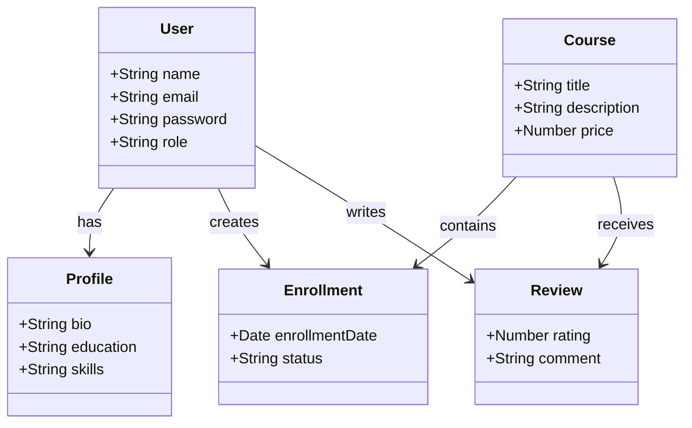

# 📚 EduPlatform API – RESTful Learning Platform

## 🌐 Présentation du projet

**EduPlatform** est une API REST conçue pour une plateforme d’apprentissage en ligne.
Elle permet la gestion complète des utilisateurs, des profils, des cours, des inscriptions et des avis.

Ce projet vise à démontrer la maîtrise de :

* MongoDB & Mongoose
* Architecture RESTful
* Relations entre collections (NoSQL)
* Authentification sécurisée via JWT
* Structuration propre d’une API backend

---

## 🎯 Objectifs du projet

* Gérer les utilisateurs (étudiant / instructeur / admin)
* Créer, modifier et supprimer des cours
* Permettre l’inscription des utilisateurs aux cours
* Gérer les avis (reviews) sur les cours
* Sécuriser les routes avec JWT
* Appliquer une architecture backend propre et organisée

---

## 🛠️ Technologies utilisées

* **Node.js**
* **Express.js**
* **MongoDB**
* **Mongoose**
* **JWT (JSON Web Token)**
* **Postman / Thunder Client** (pour le test des routes)

---

## 📊 Diagramme de l’architecture générale



---

## 📊 Diagramme des relations de données (UML simplifié)



---

## 🗂️ Structure du projet

```
EduPlatform/
│
├── src/
│   ├── controllers/
│   ├── models/
│   ├── routes/
│   ├── middlewares/
│   ├── config/
│   └── app.js
│
├── .env
├── package.json
└── server.js
```

---

## 🔗 Relations entre les collections

| Collection          | Relation |
| ------------------- | -------- |
| User → Profile      | 1 : 1    |
| User → Enrollment   | 1 : N    |
| Course → Enrollment | 1 : N    |
| Course → Review     | 1 : N    |
| User → Review       | 1 : N    |

✅ Cela signifie :

* Un utilisateur possède un seul profil
* Un utilisateur peut s’inscrire à plusieurs cours
* Un cours peut avoir plusieurs inscriptions
* Un cours peut recevoir plusieurs avis
* Chaque avis est écrit par un utilisateur

---

## 🚀 Installation & lancement

1. Cloner le projet :

```
git clone https://github.com/username/EduPlatform.git
```

2. Installer les dépendances :

```
npm install
```

3. Créer un fichier `.env` :

```
PORT=5000
MONGO_URI=your_mongodb_uri
JWT_SECRET=your_secret_key
```

4. Lancer le serveur :

```
npm start
```

Le serveur fonctionne par défaut sur :

```
http://localhost:5000
```

---

## ✅ Fonctionnalités implémentées

* Authentification (register / login)
* CRUD Utilisateurs
* CRUD Cours
* Inscriptions aux cours
* Gestion des avis (reviews)
* Routes protégées avec JWT
* Structure MVC (models / controllers / routes)

---

## 👩‍💻 Auteur

**Hedyene Mili**
Étudiante en Génie Informatique – Data Science & Intelligence Artificielle
École Polytechnique de Sousse


---


Ce projet démontre une bonne maîtrise du développement Backend moderne avec Node.js et MongoDB.
